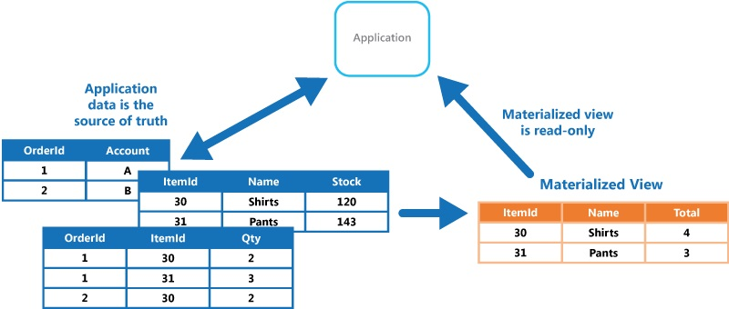

# Entity Framework

 ## Reverse Engineer Db Context
* https://docs.microsoft.com/en-us/ef/core/get-started/aspnetcore/existing-db
* https://www.learnentityframeworkcore.com/walkthroughs/existing-database

Create Model
```
dotnet ef dbcontext scaffold "Server=.\;Database=AdventureWorksLT2012;Trusted_Connection=True;" Microsoft.EntityFrameworkCore.SqlServer -o Model -c "AdventureContext"

dotnet ef dbcontext scaffold "Server=.\;Database=AdventureWorksLT2012;Trusted_Connection=True;" Microsoft.EntityFrameworkCore.SqlServer -c "AdventureContext" -d 

Scaffold-DbContext "Server=.\;Database=AdventureWorksLT2012;Trusted_Connection=True;" Microsoft.EntityFrameworkCore.SqlServer -OutputDir Model -Context "AdventureContext" -DataAnnotations
```

Specifying Tables
```
dotnet ef dbcontext scaffold "Server=.;Database=WideWorldImporters;Integrated Security=true;" Microsoft.EntityFrameworkCore.SqlServer -c WorldWideContext -o Data -t Sales.Orders -t Sales.OrderLines
```

Specifying Schema
```
dotnet ef dbcontext scaffold "Server=.;Database=WideWorldImporters;Integrated Security=true;" Microsoft.EntityFrameworkCore.SqlServer -c WorldWideContext -o Data --schema Purchasing
```

Updating the Model
```
dotnet ef dbcontext scaffold "Server=.\;Database=AdventureWorksLT2012;Trusted_Connection=True;" Microsoft.EntityFrameworkCore.SqlServer -c "AdventureContext" -force

Scaffold-DbContext "Server=.\;Database=AdventureWorksLT2012;Trusted_Connection=True;" Microsoft.EntityFrameworkCore.SqlServer -OutputDir Model -Context "AdventureContext" -Force
```

## Materialized Views
* https://docs.microsoft.com/en-gb/azure/architecture/patterns/materialized-view
* These materialized views, which only contain data required by a query, allow applications to quickly obtain the information they need. In addition to joining tables or combining data entities, materialized views can include the current values of calculated columns or data items, the results of combining values or executing transformations on the data items, and values specified as part of the query. A materialized view can even be optimized for just a single query.
* A key point is that a materialized view and the data it contains is completely disposable because it can be entirely rebuilt from the source data stores. A materialized view is never updated directly by an application, and so it's a specialized cache.
* When the source data for the view changes, the view must be updated to include the new information. You can schedule this to happen automatically, or when the system detects a change to the original data. In some cases it might be necessary to regenerate the view manually. The figure shows an example of how the Materialized View pattern might be used.

